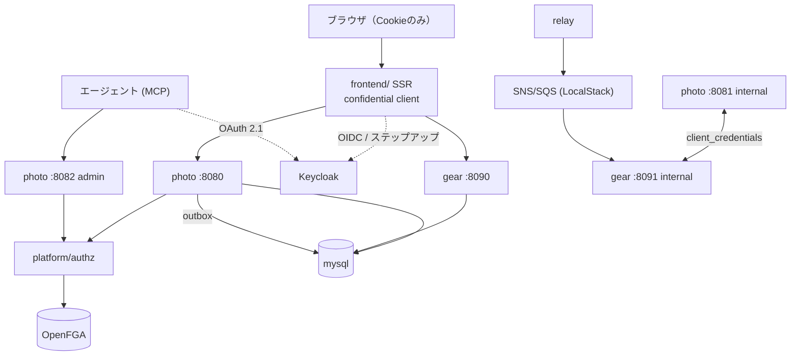

# アーキテクチャ

<!-- 区分: 検証ビルド / ステータス: Draft -->

## ドメイン（題材: カメラ情報サイト）

検証の題材は「カメラ情報サイト」とし、2つの境界づけられたコンテキストを持つ。題材は設計主張を載せるための器であり、業務の深さは追わない。

| コンテキスト | 役割 | 検証上の位置づけ |
|---|---|---|
| **photo**（写真投稿） | 写真（画像本体はオブジェクトストレージ）・キャプション・公開/非公開・所有者・使用機材（gearのitem IDのみ保持） | V1参照実装。所有者ReBAC、Atomic（投稿レコード+タプル）、署名付きURLのアップロード、migrate、オンライン改名の被験体 |
| **gear**（機材情報） | 機材（`kind`: camera / lens / tripod …）の機種情報の投稿とカタログ。作例（写真）の紐付け一覧 | V2。サービス間、Eventual、ReplicaView、pending状態パターンの相手 |

コンテキスト間の相互作用は3本で、それぞれ conventions/internal-03 の分岐に対応する。

```
photo ──(同期コマンド: 使用機材の紐付け)──▶ gear   相手の結果が今の分岐を決める → pending状態 + 冪等キー
photo ◀──(イベント: GearPublished / GearRenamed)── gear   表示用の機材名 → photo.replicaview（業務判断に使わない）
photo ──(イベント: PhotoPublished)──▶ gear             起きればよい → Eventual（gear側の作例カウント等）
```

同期コマンドの具体形: 写真投稿時に使用機材を指定すると、photoは `GearLinkPending` としてAtomicで確定し、tx外で `POST /items/{id}:link-photo`（`Idempotency-Key` 付き）をgearへ発行し、結果を別のAtomicで `GearLinked` / `GearLinkRejected`（機材が非公開・存在しない等）へ反映する。gear停止中は pending のまま残り、回収ジョブが冪等キーで照会して確定させる（04 #11）。

画像本体はDBに入れず、S3互換のオブジェクトストレージに置く。アプリはバイト列を通さず署名付きURLを発行するだけで、クライアントが直接 PUT する。オブジェクトストレージは外部システムなのでAtomicに載せられないため、「無害な側（オブジェクトだけ存在）」を先に作り、`pending_upload` → `:commit`（実体確認）→ `ready` の順で確定させる（docs/adr/0009）。放置された `pending_upload` は `photo reclaim` が回収する。

認可は photo / gear とも「所有者（投稿者）+ platform operator」の同型モデル（03のFGA最小モデル）。危険操作サンプルはアカウント削除（全投稿の削除）とし、ステップアップの検証対象（任意）に充てる。

## リポジトリ構成

プロダクション版 conventions/internal-01 の構成に、自作する基盤（platform/）とフロントを足した形。単一モノレポ、go.work + マルチモジュール。

```
.
├── go.work
├── core/                        # 差し込み口・consistency・httpclient・middleware（規約は conventions/ 準拠）
├── platform/
│   └── authz/                   # go.mod: check / batch-check / list-objects / tuples:write → OpenFGA
├── infra/                       # IaC（compose常駐ホスト、任意でECS/ALB。試作のため同居。realm定義は deploy/compose/keycloak/ 側）
├── services/
│   ├── photo/    photo-client/  # 参照実装（V1、写真投稿）。3リスナー・Atomic・ReBAC・migrateサブコマンド
│   └── gear/ gear-client/  # 第2コンテキスト（V2、カメラ情報）。サービス間・Eventual・ReplicaView
├── api/                         # 生成OpenAPI（唯一の共有契約置き場、手書き禁止）
├── frontend/                    # 任意（V3）: React Router SSR。pnpm workspace
├── deploy/compose/              # ローカル一式
├── dev/allinone/
└── docs/                        # 本設計書一式
```

## ローカル環境（docker compose）

| サービス | 役割 |
|---|---|
| mysql:8 | 全DB（本番と同エンジン）。database: photo / gear / platform + kratos / hydra / openfga 各専用 |
| keycloak | OIDC OP（realm定義JSONを `--import-realm` で毎回再現。CIでも同一コンテナが立つ）。ポート8180 |
| openfga | ReBACエンジン。platform/authz からのみ到達 |
| rustfs | 画像オブジェクト（S3互換）。署名付きURLの検証が本物と同じに働くことが選定理由（docs/adr/0008） |
| localstack | SNS + SQS FIFO（Eventual基盤）。S3 は使わない |
| flagd | フィーチャーフラグ（OpenFeatureプロバイダ。フラグ定義はリポジトリ内ファイルをgit管理） |
| otel-collector + jaeger | トレース。昇格シグナルの観測手段を初日から持つ（可観測性なしでは昇格条件が絵に描いた餅になるため） |

ローカル環境は conventions/internal-07-local-dev.md の二段構えに従う。Tier 1（既定）はポート直（photo: 8080/8081/8082、gear: 8090/8091/8092）+ `dev/allinone` + devトークンCLI。Tier 2はcomposeのCaddyで `*.localhost` のホストベースルーティングを組む。issuer整合（conventions/internal-07の罠）の扱い: Tier 1ではGoアプリを**ホストプロセス**で動かし（コンテナはmysql/keycloak等のインフラのみ）、issuer = `http://localhost:8180` がブラウザ・アプリ双方から同じ名前で解決するため罠は発生しない。CIも同様（ランナー上でアプリ実行）。罠が効くのはアプリをコンテナ化するTier 2（SSR等）のみで、そこではCaddyのnetwork aliasで `auth.localhost` に統一する。SSR系（Phase 5）の検証はTier 2、Phase 0〜4の大半はTier 1で行う。クラウド展開はPhase 7（AWS検証）のみとし、単一VPC + ALB + ECS + RDSの最小構成を `terraform apply → 検証 → destroy` の使い捨てで回す（Phase 0〜6はクラウド費用ゼロ）。TGW・egress統制は模擬しない（01のスコープ外）。

## 全体像



DBロール・スキーマ分離、3リスナー、Atomic/Eventual、クライアント生成と配布は conventions/ のプロダクション規約をそのまま適用する。
