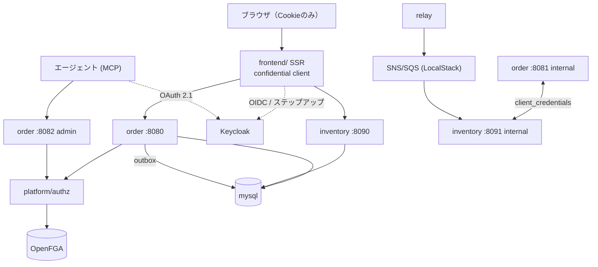

# アーキテクチャ

<!-- 区分: 検証ビルド / ステータス: Draft -->

## リポジトリ構成

プロダクション版 conventions/internal-01 の構成に、自作する基盤（platform/）とフロントを足した形。単一モノレポ、go.work + マルチモジュール。

```
.
├── go.work
├── core/                        # 差し込み口・consistency・httpclient・middleware（規約は conventions/ 準拠）
├── platform/
│   └── authz/                   # go.mod: check / batch-check / list-objects / tuples:write → OpenFGA
├── infra/                       # IaC（compose常駐ホスト、任意でECS/ALB。試作のため同居。realm定義は deploy/compose/keycloak/ 側）
├── services/
│   ├── order/    order-client/  # 参照実装（V1）。3リスナー・Atomic・ReBAC・migrateサブコマンド
│   └── inventory/ inventory-client/  # 第2コンテキスト（V2）。サービス間・Eventual・ReplicaView
├── api/                         # 生成OpenAPI（唯一の共有契約置き場、手書き禁止）
├── frontend/                    # 任意（V3）: React Router SSR。pnpm workspace
├── deploy/compose/              # ローカル一式
├── dev/allinone/
└── docs/                        # 本設計書一式
```

## ローカル環境（docker compose）

| サービス | 役割 |
|---|---|
| mysql:8 | 全DB（本番と同エンジン）。database: order / inventory / platform + kratos / hydra / openfga 各専用 |
| keycloak | OIDC OP（realm定義JSONを `--import-realm` で毎回再現。CIでも同一コンテナが立つ）。ポート8180 |
| openfga | ReBACエンジン。platform/authz からのみ到達 |
| localstack | SNS + SQS FIFO（Eventual基盤） |
| flagd | フィーチャーフラグ（OpenFeatureプロバイダ。フラグ定義はリポジトリ内ファイルをgit管理） |
| otel-collector + jaeger | トレース。昇格シグナルの観測手段を初日から持つ（可観測性なしでは昇格条件が絵に描いた餅になるため） |

ローカル環境は conventions/internal-07-local-dev.md の二段構えに従う。Tier 1（既定）はポート直（order: 8080/8081/8082、inventory: 8090/8091/8092）+ `dev/allinone` + devトークンCLI。Tier 2はcomposeのCaddyで `*.localhost` のホストベースルーティングを組む。issuer整合（conventions/internal-07の罠）の扱い: Tier 1ではGoアプリを**ホストプロセス**で動かし（コンテナはmysql/keycloak等のインフラのみ）、issuer = `http://localhost:8180` がブラウザ・アプリ双方から同じ名前で解決するため罠は発生しない。CIも同様（ランナー上でアプリ実行）。罠が効くのはアプリをコンテナ化するTier 2（SSR等）のみで、そこではCaddyのnetwork aliasで `auth.localhost` に統一する。SSR系（Phase 5）の検証はTier 2、Phase 0〜4の大半はTier 1で行う。クラウド展開はPhase 7（AWS検証）のみとし、単一VPC + ALB + ECS + RDSの最小構成を `terraform apply → 検証 → destroy` の使い捨てで回す（Phase 0〜6はクラウド費用ゼロ）。TGW・egress統制は模擬しない（01のスコープ外）。

## 全体像



DBロール・スキーマ分離、3リスナー、Atomic/Eventual、クライアント生成と配布は conventions/ のプロダクション規約をそのまま適用する。
